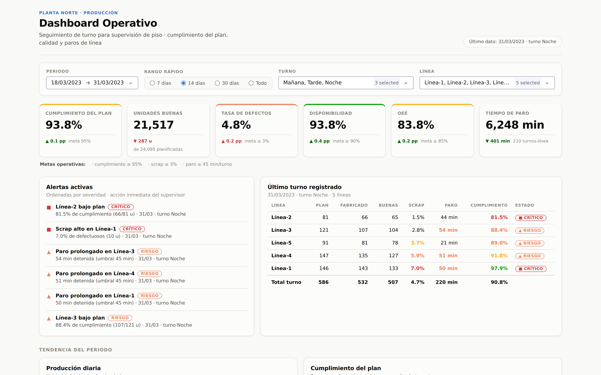
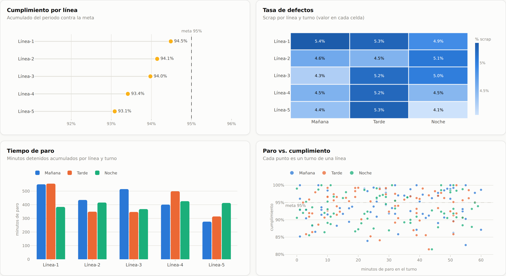

# Dashboard Operativo de Producción

Dashboard **de nivel operativo** para supervisión de piso en una planta de
manufactura: cumplimiento del plan, calidad y paros de línea, con indicadores de
corto plazo (turno y día).

Construido con **Python + Dash + Plotly**, con diseño propio en CSS.



---

## Cómo ejecutarlo

Necesitas **Python 3.10 o superior**. Desde la carpeta del proyecto:

<details open>
<summary><b>Windows (PowerShell / CMD)</b></summary>

```powershell
python -m venv .venv
.venv\Scripts\activate
pip install -r requirements.txt
python app.py
```

</details>

<details>
<summary><b>Windows (Git Bash)</b></summary>

```bash
python -m venv .venv
source .venv/Scripts/activate
pip install -r requirements.txt
python app.py
```

</details>

<details>
<summary><b>macOS / Linux</b></summary>

```bash
python3 -m venv .venv
source .venv/bin/activate
pip install -r requirements.txt
python app.py
```

</details>

Después abre **<http://127.0.0.1:8050>** en el navegador.

> **Atajo en Windows:** doble clic en `ejecutar.bat`. Crea el entorno virtual la
> primera vez, instala las dependencias y abre el navegador solo.

Para detenerlo, `Ctrl + C` en la terminal.

---

## Qué muestra

El tablero se lee de arriba hacia abajo en tres niveles de detalle creciente.

**1 · Estado actual** — Fila de KPIs con semáforo, panel de alertas ordenadas por
severidad y tabla del último turno registrado con formato condicional.

**2 · Tendencia del periodo** — Producción diaria contra el plan y porcentaje de
cumplimiento día a día.

**3 · Desempeño por línea y turno** — Cumplimiento por línea, mapa de calor de la
tasa de defectos, tiempo de paro acumulado y relación entre paro y cumplimiento.

Los filtros de periodo, turno y línea recalculan todo el tablero: los seis KPIs,
las seis gráficas, la tabla y las alertas.



---

## Indicadores implementados

| KPI | Fórmula | Meta |
|---|---|---|
| Cumplimiento del plan | Fabricado ÷ Planificado | ≥ 95 % |
| Unidades buenas | Fabricado − Defectuosos | — |
| Tasa de defectos (scrap) | Defectuosos ÷ Fabricado | ≤ 3 % |
| Disponibilidad | (480 − paro) ÷ 480 por turno | ≥ 90 % |
| Calidad | 1 − scrap | — |
| OEE | Disponibilidad × Rendimiento × Calidad | ≥ 85 % |
| Tiempo de paro | Suma de `TiempoParada_min` | ≤ 45 min/turno |

Cada KPI se compara contra el **periodo inmediato anterior de igual duración** y
se colorea con un semáforo de cuatro estados: en meta, atención, riesgo y
crítico. Las metas viven en [`src/config.py`](src/config.py) y se pueden ajustar
en un solo lugar.

---

## Los datos

`data/produccion.csv` — 1 350 registros: 90 días × 3 turnos × 5 líneas
(01/01/2023 a 31/03/2023).

| Columna | Descripción |
|---|---|
| `Fecha` | Día de producción |
| `Turno` | Mañana, Tarde o Noche |
| `Máquina` | Línea de producción (1 a 5) |
| `Planificado` | Unidades planificadas para el turno |
| `Fabricado` | Unidades producidas |
| `Defectuosos` | Unidades defectuosas |
| `TiempoParada_min` | Minutos de línea detenida |

---

## Estructura del proyecto

```
dashboard_datos/
├── app.py                  layout y callbacks de Dash
├── ejecutar.bat            arranque en un clic (Windows)
├── requirements.txt
├── src/
│   ├── config.py           metas operativas, paleta y plantilla de Plotly
│   ├── datos.py            carga del CSV, KPIs, agregaciones y alertas
│   ├── graficas.py         las seis figuras de Plotly
│   └── componentes.py      tarjetas KPI, panel de alertas y tabla del turno
├── assets/styles.css       diseño (Dash carga /assets automáticamente)
├── data/produccion.csv     fuente de datos
├── scripts/
│   ├── capturas.py         capturas automáticas con Playwright
│   └── reporte.js          genera el reporte .docx
├── screenshots/            imágenes del dashboard funcionando
└── reporte/                reporte escrito (3 páginas)
```

---

## Criterios de diseño

- **Un solo eje por gráfica.** Unidades y porcentajes se separan en dos gráficas
  en vez de usar un doble eje, que distorsiona la comparación.
- **Cumplimiento por línea como puntos, no barras.** Las diferencias entre líneas
  son de décimas de punto; una barra desde cero las volvería indistinguibles. Al
  no ser un área, el eje puede recortarse sin engañar.
- **Color asignado por función.** Categórico para la identidad del turno,
  secuencial de un solo tono para el scrap, y una paleta de estado reservada
  para el semáforo.
- **Ningún valor depende solo del color.** El mapa de calor y la tabla muestran
  siempre la cifra, y cada estado lleva ícono y etiqueta de texto: el tablero
  sigue siendo legible con daltonismo y en impresión a blanco y negro.
- **Las alertas van antes que las gráficas.** El público son supervisores: la
  primera pantalla debe decir qué hacer, no describir el proceso.

---

## Créditos

Práctica académica de la materia **Visualización de Datos**: diseño e
implementación de un dashboard operativo.
